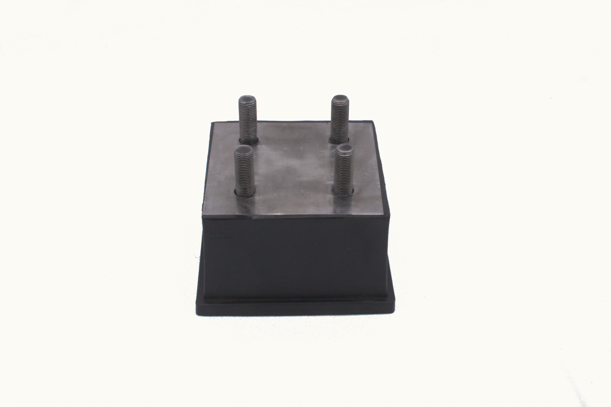
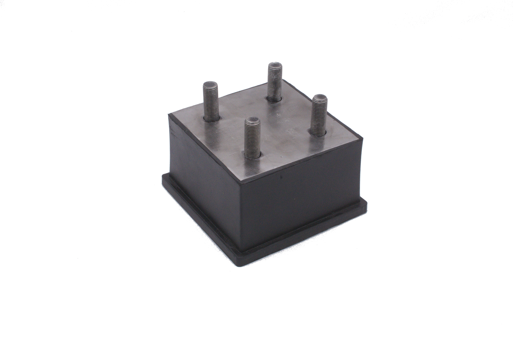
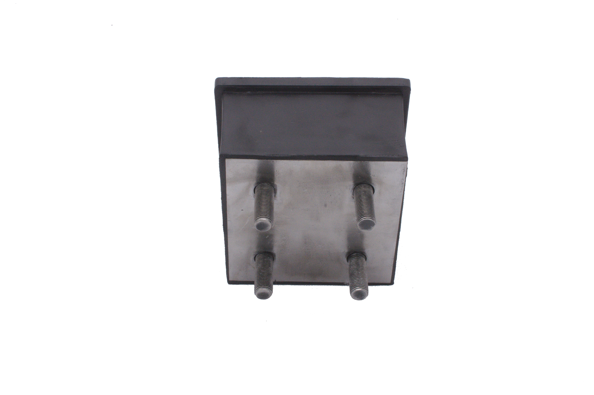
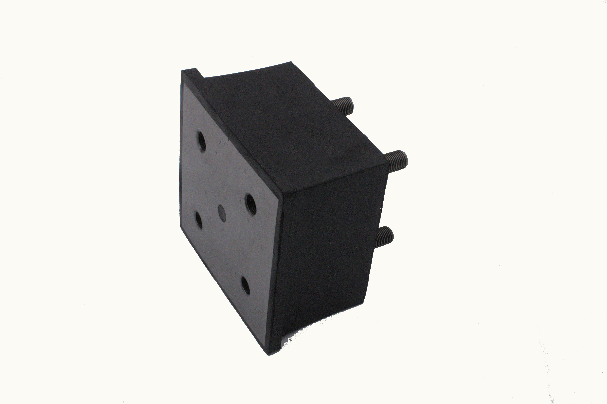
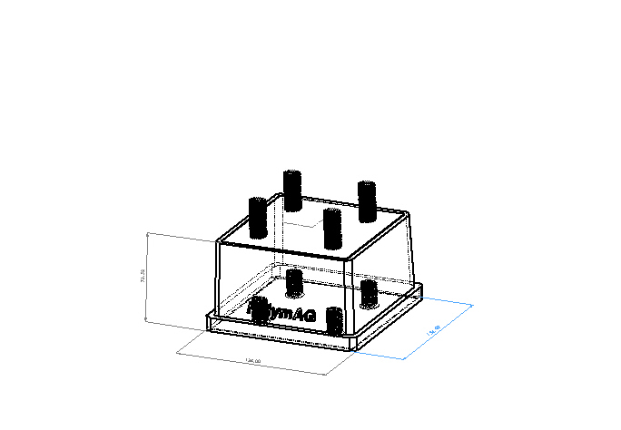
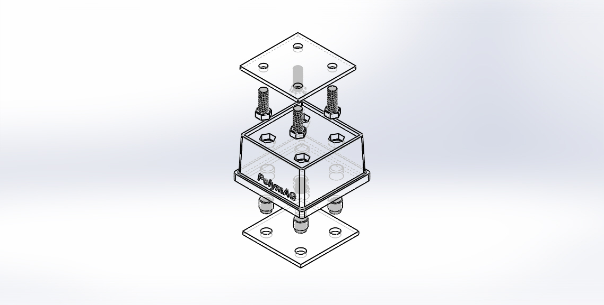

Soporte / Amortiguador de hule antivibratorio para vibrocompactadores diseñado para coadyuvar en la compactación del suelo durante el proceso de la construcción. 

<head>
  <meta charset="UTF-8">
  <meta name="viewport" content="width=device-width, initial-scale=1.0">
  <link rel="stylesheet" href="https://cdn.jsdelivr.net/npm/bootstrap@4.0.0/dist/css/bootstrap.min.css"
    integrity="sha384-Gn5384xqQ1aoWXA+058RXPxPg6fy4IWvTNh0E263XmFcJlSAwiGgFAW/dAiS6JXm" crossorigin="anonymous">
  <link rel="stylesheet" href="style.css">
</head>

<body>
  

    

      <ol class="carousel-indicators">
        <li data-target="#carouselExampleIndicators" data-slide-to="0" class="active"></li>
        <li data-target="#carouselExampleIndicators" data-slide-to="1"></li>
        <li data-target="#carouselExampleIndicators" data-slide-to="2"></li>
        <li data-target="#carouselExampleIndicators" data-slide-to="3"></li>
        <li data-target="#carouselExampleIndicators" data-slide-to="4"></li>
        <li data-target="#carouselExampleIndicators" data-slide-to="5"></li>
      </ol>
      

        

          
          

            <h5>Tematerra</h5>
          

        

        

          
            

            <h5>Tematerra</h5>
          

        

        

          
            

            <h5>Tematerra</h5>
          

        

        

          
            

            <h5>Tematerra</h5>
          

        

        

          
            

            <h5>Tematerra</h5>
          

        

        

          
            

            <h5>Tematerra</h5>
          

        

      

      <a class="carousel-control-prev" href="#carouselExampleIndicators" role="button" data-slide="prev">
        
        Previous
      </a>
      <a class="carousel-control-next" href="#carouselExampleIndicators" role="button" data-slide="next">
        
        Next
      </a>
    

  

  ## Modelo 3D

  
  
  
</body>

<iframe src="model/model.html" width="100%" height="500px"></iframe>