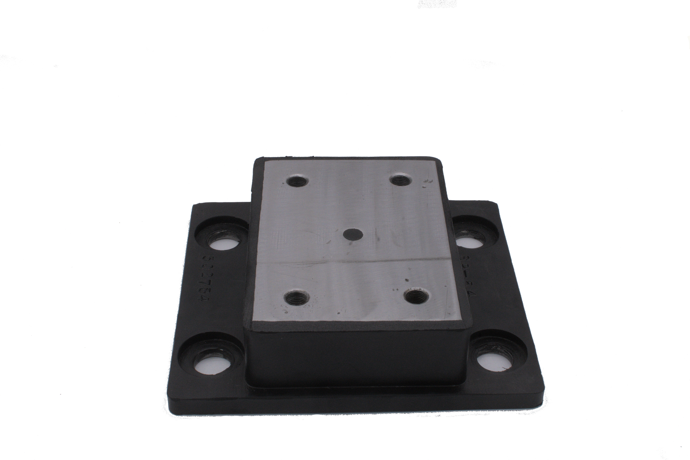
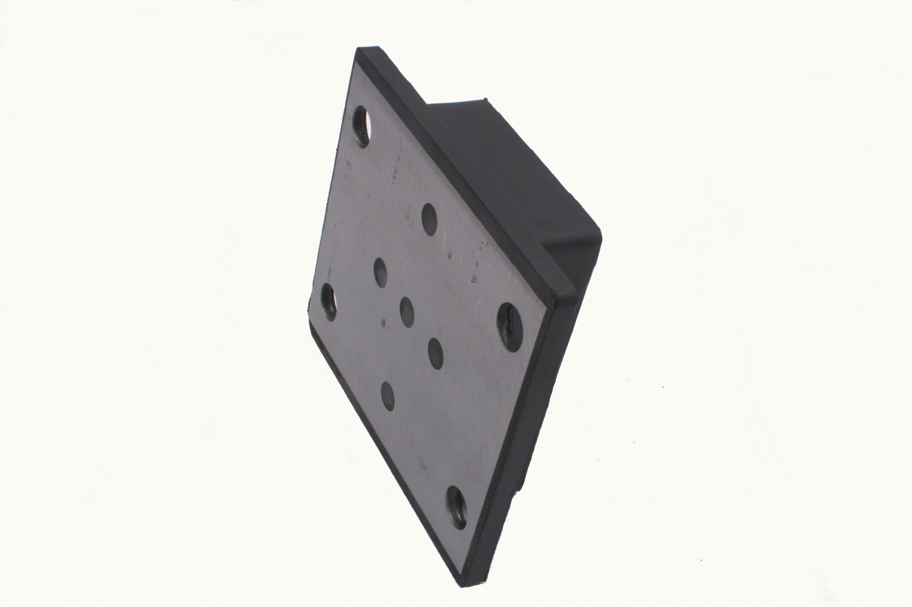

## Titulo 1
Lorem ipsum dolor sit amet, consectetur adipiscing elit. Quisque id cursus erat, sit amet congue dolor. Suspendisse vitae ultrices tortor. Morbi fringilla condimentum pharetra. Donec augue diam, viverra non orci vel, rutrum iaculis ex. Nam at neque bibendum, dignissim lacus eu, accumsan nulla. Sed vel nulla vel ipsum tincidunt vestibulum vestibulum sed nunc. Phasellus sit amet mauris nunc. Ut laoreet vehicula sollicitudin. Mauris cursus hendrerit libero, quis placerat nunc rutrum at. Pellentesque volutpat libero ut malesuada laoreet. Morbi porttitor maximus dignissim. Mauris gravida hendrerit odio, et rutrum diam porttitor eu.

Sed orci turpis, viverra non mi eu, bibendum lacinia enim. Ut bibendum facilisis lectus, vel laoreet arcu porta in. Nullam ut est placerat, blandit velit id, accumsan ipsum. Suspendisse sed dapibus elit, ut lobortis nunc. Nunc pretium lectus lectus, non auctor nisi gravida vitae. Curabitur iaculis velit ligula, at faucibus risus bibendum hendrerit. Vivamus ornare mollis leo, in malesuada lectus bibendum non. Donec ut risus malesuada, condimentum metus eu, feugiat massa. Fusce eu risus lectus. Vestibulum eu est est. Maecenas sed tortor in lacus fringilla interdum. Aliquam sem quam, consectetur quis aliquam eget, vulputate vel tortor.

Vivamus tellus sem, bibendum nec urna eget, pulvinar condimentum massa. Cras vel porta nibh. Maecenas vitae consectetur turpis, nec aliquet massa. Aenean ornare pulvinar tristique. Praesent volutpat arcu justo, non fringilla erat lobortis eget. Quisque at mi neque. Lorem ipsum dolor sit amet, consectetur adipiscing elit. Nam fringilla, enim non aliquam tincidunt, eros mi ultricies tellus, sit amet volutpat eros sem ac sapien. Quisque accumsan tincidunt nunc rutrum cursus. Donec accumsan eu nulla eu maximus. Vestibulum vel blandit ipsum. Nullam aliquet dui vitae leo venenatis commodo. Vivamus fermentum orci ut turpis tristique fermentum in id massa.

## Titulo 2
Fusce posuere rutrum dapibus. Phasellus porta est eu lacus fermentum, in hendrerit nibh porta. Nulla et consequat tellus. Curabitur quam nisl, scelerisque vel aliquet ut, efficitur commodo ipsum. Suspendisse ut vulputate massa. Mauris et imperdiet ex, eu laoreet tortor. Proin sollicitudin nisl risus, in tincidunt nulla bibendum eu. Pellentesque non ultricies magna, eu pellentesque orci. Maecenas maximus non felis eget sodales. Nulla mauris lacus, auctor vel molestie eu, volutpat rhoncus sem.

Aenean congue lectus a neque commodo laoreet. Quisque ut ante at magna vehicula pharetra. Sed lobortis nulla et magna auctor aliquet. Suspendisse ut massa id purus iaculis consequat nec sed nisl. Phasellus pellentesque diam vel purus malesuada fermentum. Cras sodales felis blandit, facilisis lorem sagittis, viverra augue. Integer condimentum mi erat, sed tristique nibh elementum eget. Cras eu ipsum non dui posuere maximus. Curabitur eget sollicitudin nulla, a euismod augue. Proin ac malesuada velit. Fusce efficitur bibendum risus, at tincidunt nisi maximus laoreet. Nullam quis tristique nisi. Pellentesque semper nulla et felis varius, ut tempor quam mollis. Nulla facilisi.

Sed vel massa vel tellus condimentum hendrerit. Fusce euismod quis ante eu eleifend. Aliquam sit amet dui velit. Vestibulum convallis sem eget congue hendrerit. Pellentesque mollis tortor nec ultricies faucibus. Mauris ut eleifend dolor. Nullam lobortis diam nec velit tempor finibus. Class aptent taciti sociosqu ad litora torquent per conubia nostra, per inceptos himenaeos. Vivamus lobortis ultricies lacinia. Quisque nec elementum leo. Pellentesque vitae mauris pretium, semper orci vel, suscipit ipsum. Cras odio urna, pellentesque ut ligula eu, finibus efficitur nulla.

## Titulo 3
### Subtitulo 1
Suspendisse hendrerit sapien sed fringilla lobortis. In vulputate enim in tellus consequat porttitor. In lacus est, aliquet non ligula ut, ultricies varius massa. Vivamus elementum lacus vitae nunc vulputate, eget consequat neque maximus. Nullam convallis ornare orci, sit amet tempor nunc mattis eget. Aenean a dui odio. Vestibulum imperdiet, tortor vel feugiat eleifend, turpis nunc pretium tortor, eget lobortis orci ligula pulvinar tortor. Maecenas lacus dolor, posuere eget tincidunt ut, luctus sit amet ex. Sed sodales aliquam diam, nec rutrum sapien porttitor quis. Aliquam vestibulum tortor elit, ac vulputate arcu consectetur et. In mauris lacus, mattis eget vulputate in, laoreet in leo. Maecenas maximus vestibulum ipsum eu pellentesque. Integer faucibus pharetra est nec faucibus. Maecenas ut dui venenatis, viverra risus at, laoreet quam. Donec pulvinar mi mauris, sed auctor magna consequat at.

Mauris consequat urna turpis, at tristique nunc placerat vel. In dictum massa vitae dui aliquam, sed porta tortor viverra. Nullam molestie nulla in metus volutpat luctus. Vivamus a auctor mi, sed molestie est. Nam tempor enim a tellus rhoncus, in condimentum nisi scelerisque. Maecenas eget leo facilisis, lacinia dolor a, faucibus est. Nam aliquam sem eu lacus elementum, vel hendrerit mi imperdiet.

<head>
  <meta charset="UTF-8">
  <meta name="viewport" content="width=device-width, initial-scale=1.0">
  <link rel="stylesheet" href="https://cdn.jsdelivr.net/npm/bootstrap@4.0.0/dist/css/bootstrap.min.css"
    integrity="sha384-Gn5384xqQ1aoWXA+058RXPxPg6fy4IWvTNh0E263XmFcJlSAwiGgFAW/dAiS6JXm" crossorigin="anonymous">
  <link rel="stylesheet" href="style.css">
  
  <title>Document</title>
</head>

<body>
  

    

      <ol class="carousel-indicators">
        <li data-target="#carouselExampleIndicators" data-slide-to="0" class="active"></li>
        <li data-target="#carouselExampleIndicators" data-slide-to="1"></li>
        <li data-target="#carouselExampleIndicators" data-slide-to="2"></li>
      </ol>
      

        

          
          

            <h5>Soporte Ingerson I001</h5>
          

        

        

          
            

            <h5>Soporte Ingerson I001</h5>
          

        

        

          
            

            <h5>Soporte Ingerson I001</h5>
          

        

      

      <a class="carousel-control-prev" href="#carouselExampleIndicators" role="button" data-slide="prev">
        
        Previous
      </a>
      <a class="carousel-control-next" href="#carouselExampleIndicators" role="button" data-slide="next">
        
        Next
      </a>
    

  

  
  
  
</body>

<iframe src="model/model.html" width="100%" height="700px"></iframe>