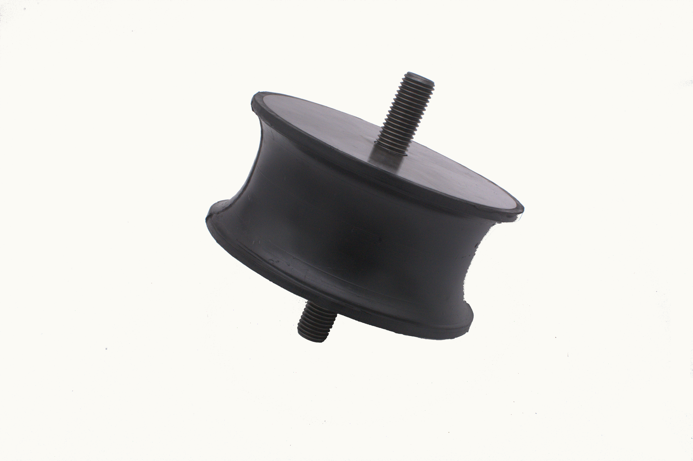
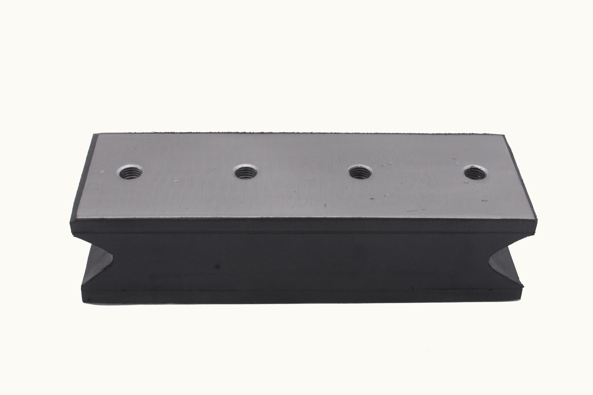
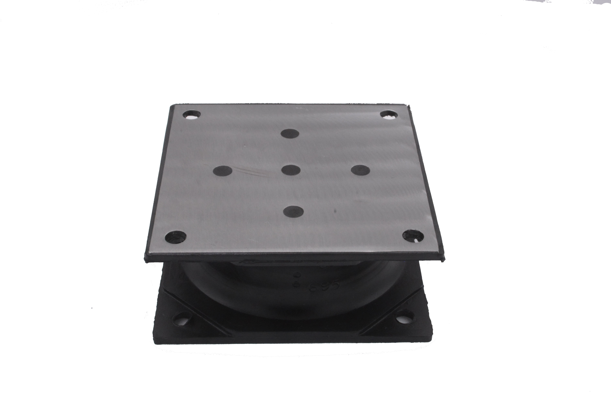
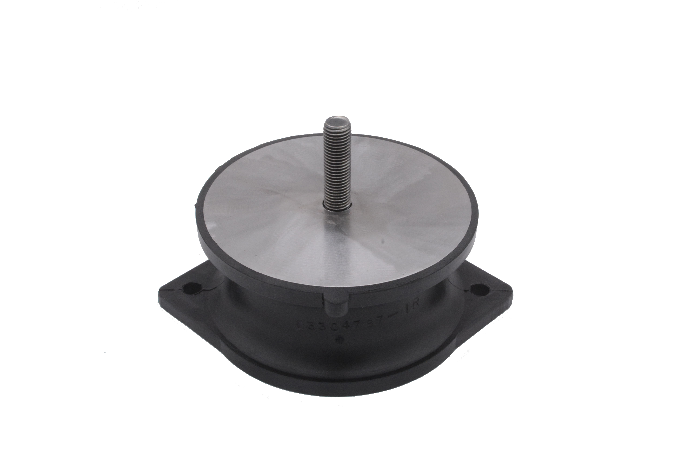
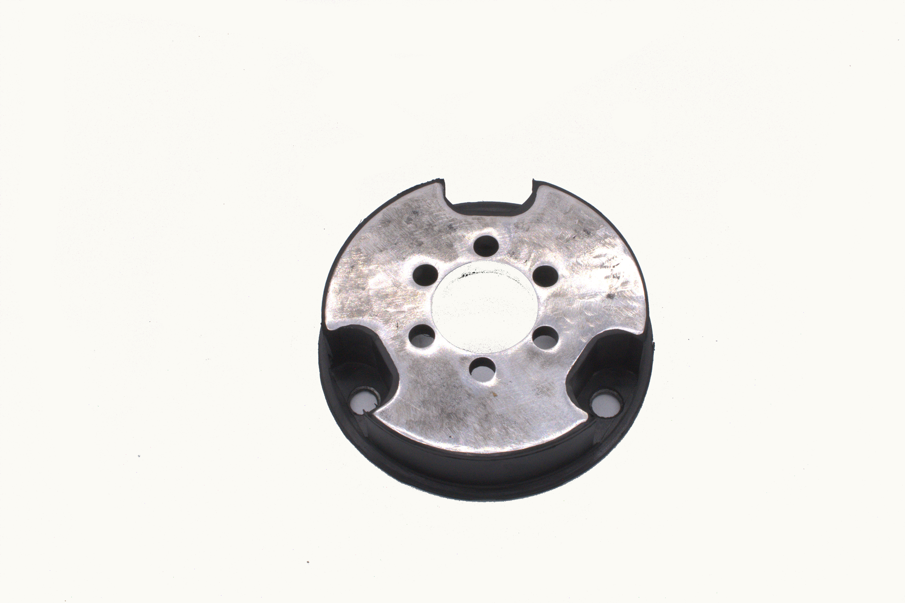

## Maquinaria pesada

<table class="table-image">
<thead>
  <tr >
    <td>Marca</td>
    <td>Nombre</td>
    <td>Ilustración</td>
    <td>Descripción</td>
  </tr>
  </thead>
  <tbody>
    <tr>
      <td class="col-1">
        <a href="../../tags/bomag/">Bomag</a>
      </td>
      <td class="col-2">
        <a href="../heavy/bomag/">Soporte / Amortiguador BOMAG</a>
      </td>
      <td class="col-5">
        
      </td>
      <td class="col-4">
        
Soporte / amortiguador de hule antivibratorio para vibrocompactadores diseñado para coadyubar en la compactación del suelo durante el proceso de la construcción.

      </td>
    </tr>
    <tr>
      <td>
        <a href="../../tags/bomag/">Bomag</a>
      </td>
      <td>
        <a href="../heavy/bomag_rectangular/">Soporte / Amortiguador BOMAG Rectangular</a>
      </td>
      <td>
        
      </td>
      <td>Soporte / amortiguador de hule antivibratorio para vibrocompactadores diseñado para coadyubar en la compactación del suelo durante el proceso de la construcción.</td>
    </tr>
    <tr>
      <td>
        <a href="../../tags/ingerson/">Ingersoll</a>
      </td>
      <td>
        <a href="../heavy/soporte_ingerson_i001/">Soporte / Amortiguador INGERSOLL</a>
      </td>
      <td>
        
      </td>
      <td>Soporte / amortiguador de hule antivibratorio para vibrocompactadores diseñado para coadyubar en la compactación del suelo durante el proceso de la construcción.</td>
    </tr>
    <tr>
      <td>
        <a href="../../tags/tampo/">Tampo</a>
      </td>
      <td>
        <a href="../heavy/tampo_hembra/">Soporte / Amortiguador hembra TAMPO</a>
      </td>
      <td>
        
      </td>
      <td>Soporte / amortiguador de hule antivibratorio para vibrocompactadores diseñado para coadyubar en la compactación del suelo durante el proceso de la construcción.</td>
    </tr>
    <tr>
      <td>
        <a href="../../tags/tampo/">Tampo</a>
      </td>
      <td>
        <a href="../heavy/tampo_macho/">Soporte / Amortiguador macho TAMPO</a>
      </td>
      <td>
        
      </td>
      <td>Soporte / amortiguador de hule antivibratorio para vibrocompactadores diseñado para coadyubar en la compactación del suelo durante el proceso de la construcción.</td>
    </tr>
    <tr>
      <td>
        <a href="../../tags/tematerra/">Tematerra</a>
      </td>
      <td>
        <a href="../heavy/tematerra/">Soporte / Amortiguador macho TEMATERRA</a>
      </td>
      <td>
        
      </td>
      <td>Soporte / amortiguador de hule antivibratorio para vibrocompactadores diseñado para coadyubar en la compactación del suelo durante el proceso de la construcción.</td>
    </tr>
    <tr>
      <td>
        <a href="../../tags/vibrocompactadores/">Vibrocompactadores</a>
      </td>
      <td>
        <a href="../heavy/dynapac/">Soporte / Amortiguador DYNAPAC</a>
      </td>
      <td>
        
      </td>
      <td>Soporte / amortiguador de hule antivibratorio para vibrocompactadores diseñado para coadyubar en la compactación del suelo durante el proceso de la construcción.</td>
    </tr>
    <tr>
      <td>
        <a href="../../tags/vibrocompactadores/">Vibrocompactadores</a>
      </td>
      <td>Soporte / Amortiguador JCB
        <a href="../heavy/jcb/">Soporte / Amortiguador JCB</a>
      </td>
      <td>
        
      </td>
      <td>Soporte / amortiguador de hule antivibratorio para vibrocompactadores diseñado para coadyubar en la compactación del suelo durante el proceso de la construcción.</td>
    </tr>
    <tr>
      <td>
        <a href="../../tags/vibrocompactadores/">Vibrocompactadores</a>
      </td>
      <td>
        <a href="../heavy/vap70_vibrocupactador/">Soporte / Amortiguador MULLER | VAP-70</a>
      </td>
      <td>
        
      </td>
      <td>Soporte / amortiguador de hule antivibratorio para vibrocompactadores diseñado para coadyubar en la compactación del suelo durante el proceso de la construcción.</td>
    </tr>
  </tbody>
</table>

## Maquinaria Ligera

<table class="table-image">
  <tr>
    <td>Nombre</td>
    <td>Ilustración</td>
    <td>Descripción</td>
  </tr>
  <tr>
      <td class="col-3">
        <a href="../light/sam-001/">Bailarinas para Manubrio WACKER</a>
      </td>
      <td class="col-4">
        
      </td>
      <td class="col-4">
        
Soporte / Amortiguador de hule para apisonadoras, bailarina o fuelle, diseñados para coadyubar en la compactación del suelo durante el proceso de construcción. 

      </td>
  </tr>
  <tr>
    <td>
      <a href="../light/sam-004/">Bailarinas para Manubrio MIKASA</a>
    </td>
    <td>
    
    </td>
    <td>Soporte / Amortiguador de hule para apisonadoras, bailarina o fuelle, diseñados para coadyubar en la compactación del suelo durante el proceso de construcción. </td>
  </tr>
  <tr>
    <td>
      <a href="../light/cople_ventilador/">Cople de ventilador DYNAPAC</a>
    </td>
    <td>
      
    </td>
    <td>Cople de ventilador DYNAPAC.</td>
  </tr>
  <tr>
    <td>
      <a href="../light/pr8_doble/">Soporte / Amortiguador PR8 doble tornillo</a>
    </td>
    <td>-
     <!--  -->
    </td>
    <td>Soporte / amortiguador de hule para vibrocompactador ligero diseñado para coadyubar en la compactación del suelo durante el proceso de construcción. </td>
  </tr>
  <tr>
    <td>
      <a href="../light/muertito/">Soporte / Amortiguador muertito para PR8</a>
    </td>
    <td>
     
    </td>
    <td>Soporte / amortiguador de hule para vibrocompactador ligero diseñado para coadyubar en la compactación del suelo durante el proceso de construcción. . </td>
  </tr>
  <tr>
    <td>
      <a href="../light/pr8/">Soporte / Amortiguador para rodillo vibratorio PR8 </a>
    </td>
    <td>
    
    </td>
    <td>Soporte / amortiguador de hule para vibrocompactador ligero diseñado para coadyubar en el compactación del suelo durante el proceso de construcción. </td>
  </tr>
</table>

<table class="table-image">
  <tr>
    <td>Marca</td>
    <td>Nombre</td>
    <td>Ilustración</td>
    <td>Descripción</td>
  </tr>
  <tr>
    <td class="col-1">
      <a href="../../tags/cartepillar/">Cartepillar</a>
    </td>
    <td class="col-2">
      <a href="../light/cople_8_bujes/">Cople 8 bujes CARTEPILLAR</a>
    </td>
    <td class="col-5">
      
    </td>
    <td class="col-4">
      
Cople de hule con 8 bujes metálicos con media cuerda.

    </td>
  </tr>
  <tr>
    <td>
      <a href="../../tags/raygo/">Raygo</a>
    </td>
    <td>
      <a href="../light/cople_6/">Cople 6 bujes RAYGO</a>
    </td>
    <td>-
      <!--  -->
    </td>
    <td>Cople de hule con 6 bujes metálicos lisos.</td>
  </tr>
</table>

## Martillo

<table>
  <tr>
    <td>Marca</td>
    <td>Nombre</td>
    <td>Ilustración</td>
    <td>Descripción</td>
  </tr>
  <tr>
    <td>
        <a href="../../tags/npk/">NPK</a>
    </td>
    <td>
      <a href="../hammer/npk/">Servicio de vulcanizado lateral NPK</a>
    </td>
    <td>-
    <!--  -->
    </td>
    <td>Servicio de vulcanizado para suspensión de martillo hidraúlico NPK</td>
  </tr>
</table>

## Coples para Compresora / Servicio para Vulcanizadora

<table>
  <tr>
    <td>Nombre</td>
    <td>Ilustración</td>
    <td>Descripción</td>
  </tr>
  <tr>
    <td>
        <a href="../coples_servicio/sombrero/">Servicio de vulcanizado para sombrero / bacinica</a>
    </td>
    <td>-
    <!--  -->
    </td>
    <td>Servicio de vulcanizado para acoplador tipo sombrero para compresor.</td>
  </tr>
  <tr>
    <td>
      <a href="../coples_servicio/volante/">Servicio de vulcanizado para volante</a>
    </td>
    <td>-
    <!--  -->
    </td>
    <td>Servicio de vulcanizado para acoplador tipo volante para compresor</td>
  </tr>
</table>

<table>
  <tr>
    <td>Marca</td>
    <td>Nombre</td>
    <td>Ilustración</td>
    <td>Descripción</td>
  </tr>
  <tr>
    <td>
      <a href="../../tags/atlas/">ATLAS</a>
    </td>
    <td>
      <a href="../coples_servicio/atlas/">Servicio de vulcanizado para sombrero / bacinica ATLAS</a>
    </td>
    <td>-
    <!--  -->
    </td>
    <td>Servicio de vulcanizado para acoplador para compresor.</td>
  </tr>
</table>

## Retroexcavadoras

<table class="table-image">
  <tr>
    <td>Nombre</td>
    <td>Ilustración</td>
    <td>Descripción</td>
  </tr>
  <tr>
    <td class="col-3">
      <a href="../excavators/soporte_para_retroexcavadora_media_luna/">Soporte para brazo medio</a>
    </td>
    <td class="col-5">
      
    </td>
    <td class="col-4">
      
Soporte de hule para brazo medio en retroexcavadoras.

    </td>
  </tr>
  <tr>
    <td class="col-3">
    <a href="../excavators/soporte_retroexcavadora/">Soporte para brazo plano</a>
    </td>
    <td class="col-5">
      
    </td>
    <td class="col-4">
      
Soporte de hule para brazo medio en retroexcavadoras.

    </td>
  </tr>
</table>

<table>
  <tr>
    <td>Marca</td>
    <td>Nombre</td>
    <td>Ilustración</td>
    <td>Descripción</td>
  </tr>
  <tr>
    <td>
      <a href="../../tags/retroexcavadora/">Retroexcavadora</a>
    </td>
    <td>
      <a href="../excavators/hongos/">Hongos para retroexcavadora</a>
    </td>
    <td>-
    <!--  -->
    </td>
    <td></td>
  </tr>
</table>

## Cañuela

<table class="table-image">
  <tr>
    <td>Nombre</td>
    <td>Ilustración</td>
    <td>Descripción</td>
  </tr>
  <tr>
    <td class="col-3">
      <a href="../canuela/diamond/">Cañuela para criba diamante</a>
    </td>
    <td class="col-5">
      
    </td>
    <td class="col-4">Cañuela de hule con tamaño de ranura en 1/4", 3/8", 1/2, 5/8".</td>
  </tr>
  <tr>
    <td>
      <a href="../canuela/gota/">Cañuela para criba gota</a>
    </td>
    <td>
    
    </td>
    <td>Cañuela de hule con tamaño de ranura en espesor de 1/4", 3/8", 1/2", 5/8".</td>
  </tr>
  <tr>
    <td>
      <a href="../canuela/round/">Cañuela para criba redonda</a>
    </td>
    <td>
    
    </td>
    <td>Cañuela de hule con tamaño de ranura en 1/4", 3/8", 1/2, 5/8".</td>
  </tr>
  <tr>
    <td>Hule Almorite</td>
    <td>-
    <!--  -->
    </td>
    <td>Rollo de hule almorite de 1.20 x 10 ó 15 metros de largo en espesor de 1/4", 3/8" y 1/2".</td>
  </tr>
  <tr>
    <td>Hule faldon</td>
    <td>-
    <!--  -->
    </td>
    <td>Rollo de hule faldon resistente a la abrasión utilizado para amotiguar vibraciones entre dos elementos, ancho disponible en 2", 3", 4", 6", 8", 10", 12", 20", 24", 28", 40" y 48". Largo disponible 15 metros y espesor de 1/4" a 1".</td>
  </tr>
</table>

<head>
  <meta charset="UTF-8">
  <meta name="viewport" content="width=device-width, initial-scale=1.0">
  <link rel="stylesheet" href="https://cdn.jsdelivr.net/npm/bootstrap@4.0.0/dist/css/bootstrap.min.css"
    integrity="sha384-Gn5384xqQ1aoWXA+058RXPxPg6fy4IWvTNh0E263XmFcJlSAwiGgFAW/dAiS6JXm" crossorigin="anonymous">
  <link rel="stylesheet" href="style.css">
</head>

