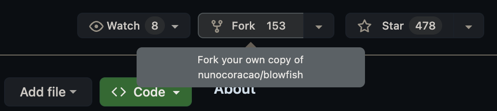
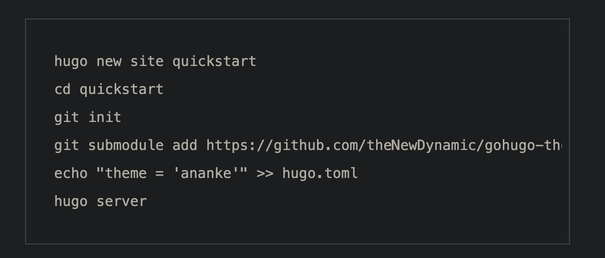
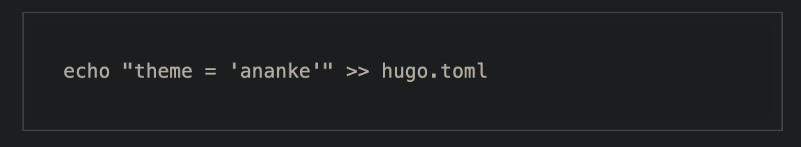
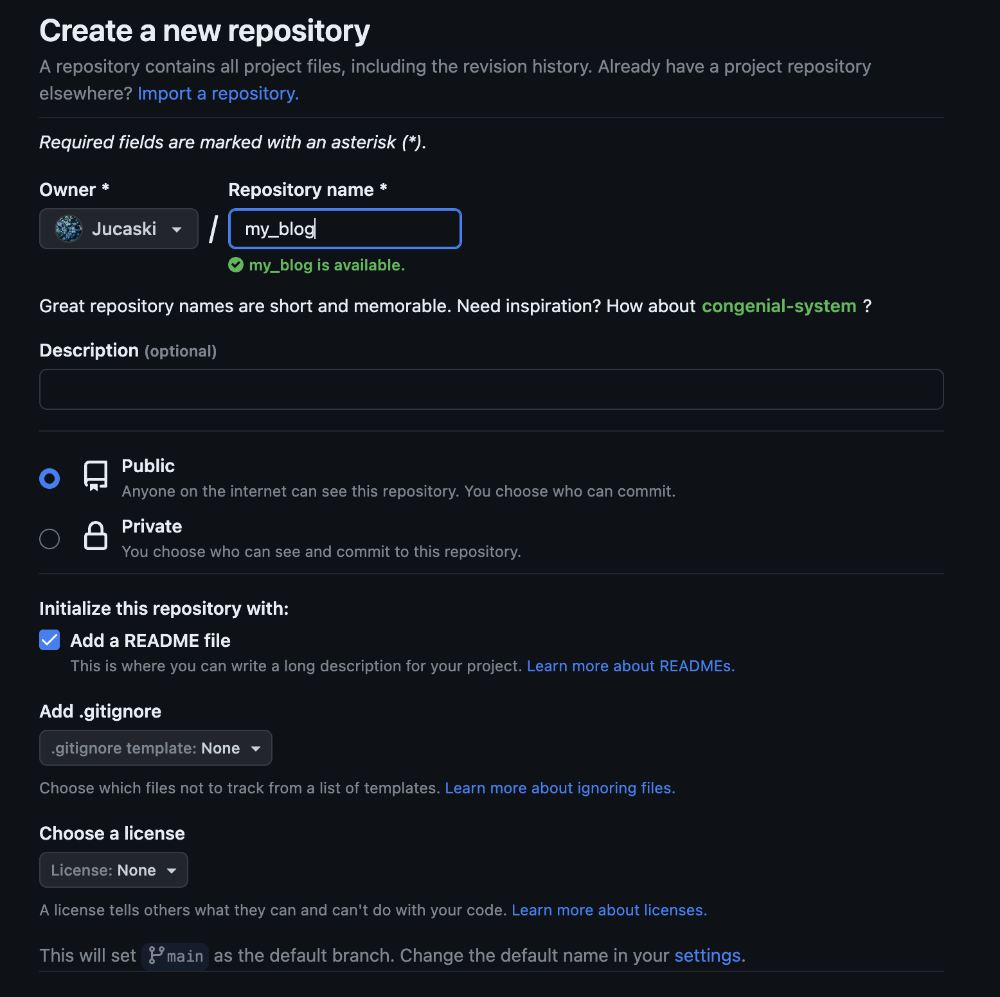

## 1. Github account
Make sure you have a [github](https://github.com/) account.

## 2. Install Hugo

<https://gohugo.io/installation/>

If you're using macOS, you can simply type:
```
brew install hugo
 ```
## 3. Install Git
Just in case you don't have it already.

<https://git-scm.com/book/en/v2/Getting-Started-Installing-Git>

## 4. Theme of your preference
You need to choose your theme from Hugo blog: <https://themes.gohugo.io/>

## 5. Fork the theme of your preference
This will allow you to have the copy all the time in your repositories, you don't have to worry if for any reason the original repo disapears.


## 6. Create Hugo site 
Follow the instructions to create a new [Hugo site](https://gohugo.io/getting-started/quick-start/#create-a-site)

And make sure to put the forked submodule of the theme you chose before.


Also add the name of the theme you chose.


## 7. Create a new repository
Make sure your repository is public, and also add a readme file



## Myblog/
Inside this folder, we need to follow the instructions of the quickstart from hugo blog
alongside with the instructions of the theme that you choose. You have to have a structure like this:


Where *theme/* will contain the submodule of the theme that you fork in your repositories

## .- Configure your config.toeml
This will depend entirely on the theme that you choose, make sure you read carefully the configuration part 

## Usually your fisrt post should be inside content/posts/
I recommend that you create a test post, don't forget you need to use .md as extention file

## You should be able to use hugo servee to compile your blog and visualize it as you want


## Now here it comes the funny part
You need to create another repository, with the exact same name as your profile, but we're add .gihub.io at the end, in my case the repository name will be Jucaski.github.io This will also be your personal url where your blog will be deploy


