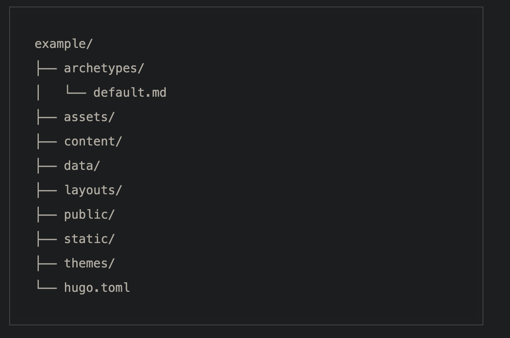

## 1. Github account
Make sure you have a [github](https://github.com/) account.

## 2. Install Hugo

<https://gohugo.io/installation/>

If you're using macOS, you can simply type:
```
brew install hugo
 ```
## 3. Install Git
Just in case you don't have it already.

<https://git-scm.com/book/en/v2/Getting-Started-Installing-Git>

## 4. Theme of your preference
You need to choose your theme from Hugo blog: <https://themes.gohugo.io/>

## 5. Fork the theme of your preference
This will allow you to have the copy all the time in your repositories, you don't have to worry if for any reason the original repo disapears.


## 6. Create Hugo site 
Follow the instructions to create a new [Hugo site](https://gohugo.io/getting-started/quick-start/#create-a-site)

And make sure to put the forked submodule of the theme you chose before.


Also add the name of the theme you chose.


Once you've created your site, you should have a directory structure like this:


**theme/** will contain the submodule of the theme that you fork in your repositories.

## 7. Create a new repository
Make sure your repository is public, also add a readme file.


Add the repository origin to the local folder of your Hugo site.


## 8. Configure your hugo.toml
This will depend entirely on the theme that you chose, make sure you read carefully the configuration of your theme.

## 9. Create your first post
[Create your post](https://gohugo.io/getting-started/quick-start/#add-content), they will be save in the content folder.

Use ```hugo serve``` to compile your blog and visualize it locally


## 10. Deploy your blog with Github Pages
You need to follow the instructions from [Hosting and Deployment](https://gohugo.io/hosting-and-deployment/hosting-on-github/#procedure), is super easy.

That's it, now you should have a blog with the same name as your usename.github.io


